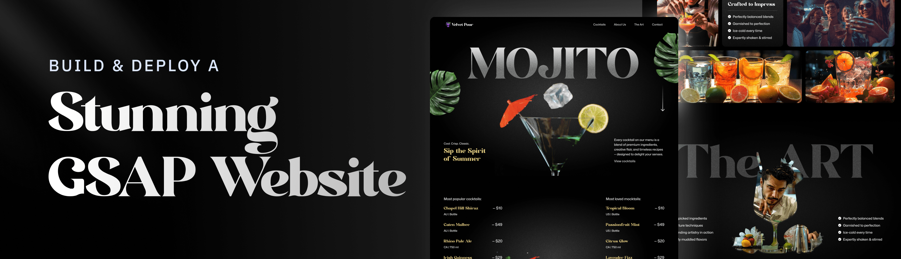

# 🍸 JSM Cocktail Lounge

A sleek, modern cocktail-themed website built as part of a [JavaScript Mastery](https://www.jsmastery.pro/) tutorial to enhance skills in **GSAP animations**, **modular JavaScript**, and **responsive UI styling**. This project showcases smooth motion effects, engaging visuals, and clean UI layout — ideal for a premium cocktail bar or mocktail lounge.

## ✨ Features

- 🚀 Smooth GSAP scroll-based animations
- 🎨 Stylish, modern UI using semantic HTML & CSS
- 🍹 Dynamic sections with reusable content arrays
- 💬 Mocktail & Cocktail showcase with pricing and details
- 📍 Store location & opening hours
- 👥 Community profile image carousel
- 🌐 Social media links & drink sliders

---

## 📁 Project Structure

```bash
src/
├── public/
│   └── images/           # Profile and drink images
├── constants/
│   └── index.js          # All content (cocktails, links, socials, etc.)
├── components/
│   └── ...               # Reusable UI components
├── App.js
└── main.js

🔧 Data Breakdown

Here’s how data is structured in the project:
📌 Navigation

navLinks = [ "Cocktails", "About Us", "The Art", "Contact" ];

🍹 Cocktail Listings

Includes name, country, detail, and price fields for both:

    cocktailLists – Alcoholic drinks

    mockTailLists – Non-alcoholic drinks

🧑‍🤝‍🧑 Profile Avatars

profileLists = [ "/images/profile1.png", ... ];

🌟 Feature Highlights

featureLists = [
 "Perfectly balanced blends",
 "Garnished to perfection",
 "Ice-cold every time",
 "Expertly shaken & stirred"

---

📫 Contact Info

storeInfo = {
 heading: "Where to Find Us",
 address: "456, Raq Blvd. #404, Los Angeles, CA 90210",
 contact: {
   phone: "(555) 987-6543",
   email: "hello@jsmcocktail.com"
 }
};

---

🛠️ Technologies Used

    JavaScript (ES6+)

    React.Js

    GSAP + ScrollTrigger

    HTML5 , CSS3 & TailwindCSS

    Responsive Design Principles

    Vite (for bundling)

📚 What I’m Learning

This project is helping me grow in:

    Writing modular and scalable frontend code

    Implementing smooth UI motion with GSAP

    Structuring content-driven UIs from data objects

    Practicing responsive layout & interactive sections

    Enhancing my attention to visual details and transitions

🚀 Getting Started

    Clone this repo

git clone https://github.com/Joshuakibwage/gsap-landing.git
cd gsap-landing

Install dependencies

npm install

Run locally

    npm run dev

🙌 Acknowledgments

Thanks to JavaScript Mastery for the tutorial inspiration and creative direction.
📸 Preview

    
